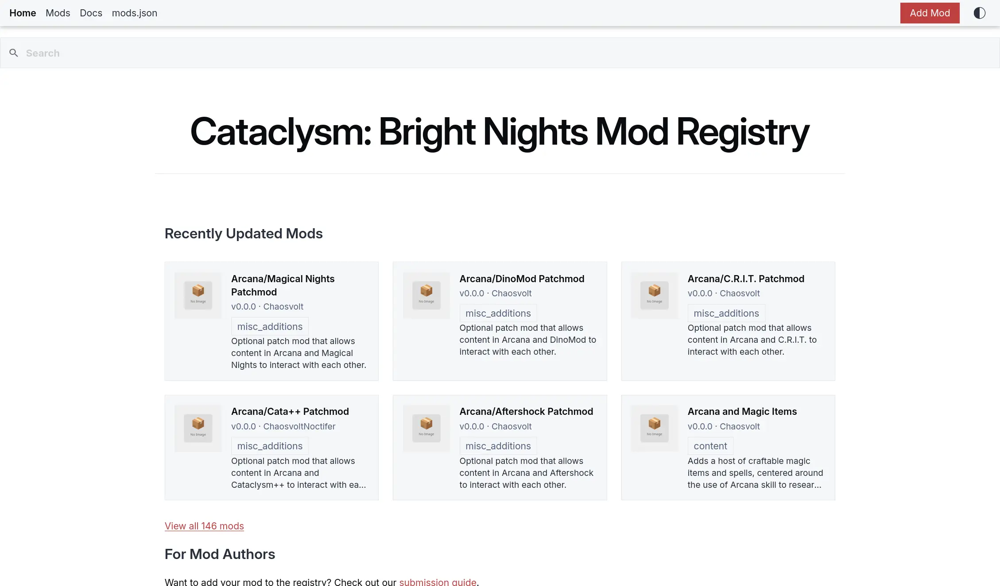

# Cataclysm: Bright Nights Mod Registry



> [!CAUTION]
> Work In Progress: Expect frequent breaking changes

The central, community-driven mod registry for
[Cataclysm: Bright Nights](https://github.com/cataclysmbnteam/Cataclysm-BN).

## For Players

Browse available mods at
[cataclysmbnteam.github.io/registry](https://cataclysmbnteam.github.io/registry).

## For Mod Authors

Add your mod to the registry:

1. Fork this repository
2. Create a manifest in `manifests/your_mod_id.yaml`
3. Run `deno task validate` to check your manifest
4. Submit a pull request

See the [submission guide](./site/docs/submit.md) for detailed instructions.

### Quick Manifest Example

```yaml
schemaVersion: "1.0"
id: my_awesome_mod
displayName: "My Awesome Mod"
shortDescription: "Adds cool stuff to the game"
author: ["Your Name"]
license: "CC-BY-SA-4.0"

version: "1.0.0"

dependencies:
  bn: ">=0.9.1"

categories:
  - content

source:
  type: github_archive
  url: "https://github.com/yourname/my-mod/archive/v1.0.0.zip"
```

## Development

### Prerequisites

- [Deno](https://deno.land/) 2.0+

### Commands

```bash
# Install dependencies (automatic with Deno)
deno task validate     # Validate all manifests
deno task check-urls   # Check all URLs are reachable
deno task generate     # Generate index files
deno task test         # Run tests
deno task build        # Build the website
deno task serve        # Run development server
```

### Project Structure

```
registry/
├── manifests/          # Mod manifest files (YAML)
├── generated/          # Auto-generated index files
├── site/               # Website source (Lume)
├── src/
│   ├── schema/         # TypeScript type definitions
│   ├── utils/          # Validation utilities
│   └── scripts/        # CLI tools (validate, generate, autoupdate)
├── tests/              # Test files
├── _config.ts          # Lume site configuration
└── deno.json           # Deno configuration
```

## Credits

Structure inspired by
[Endless Sky Plugins](https://github.com/endless-sky/endless-sky-plugins).

## License

[AGPL-3.0-only](./LICENSE)
